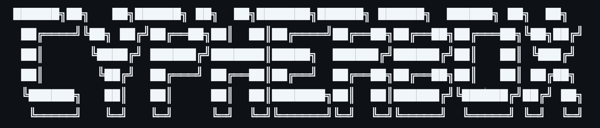
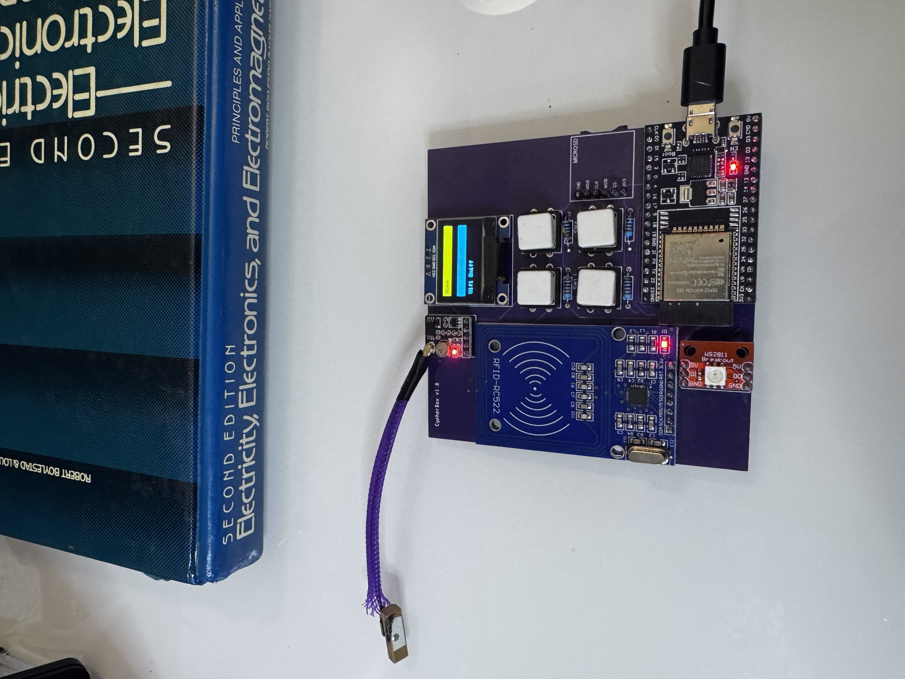
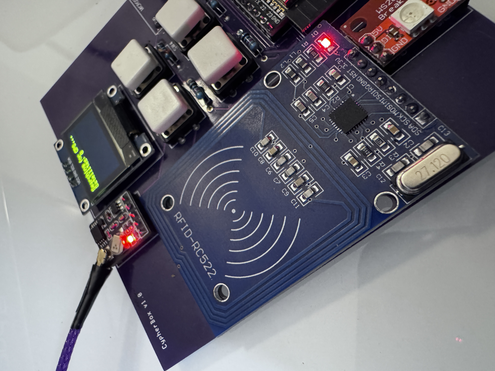
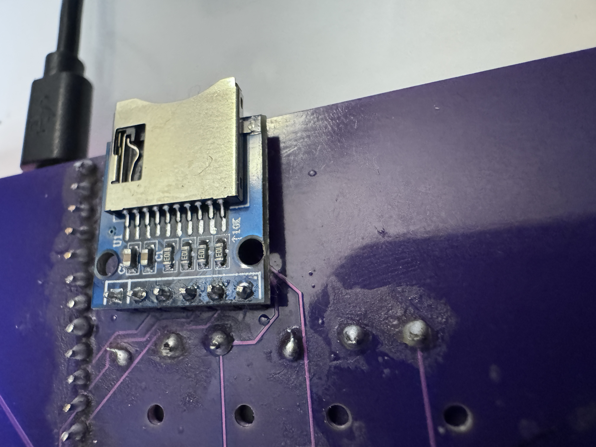
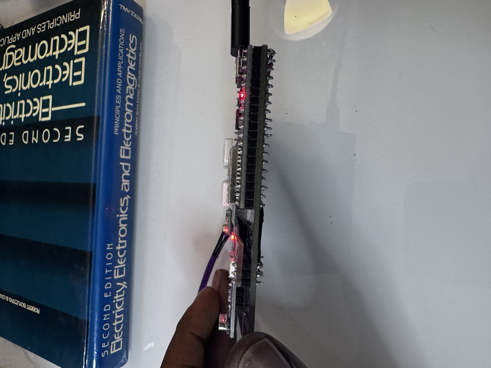
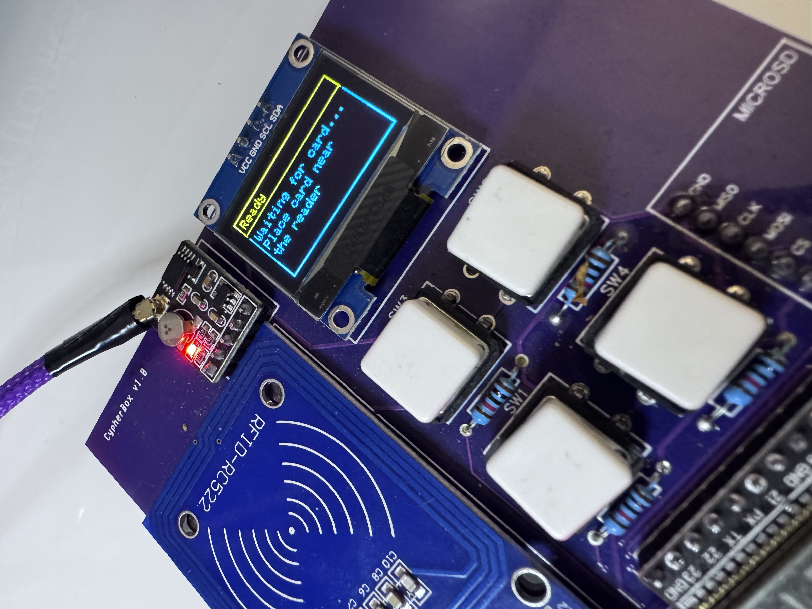
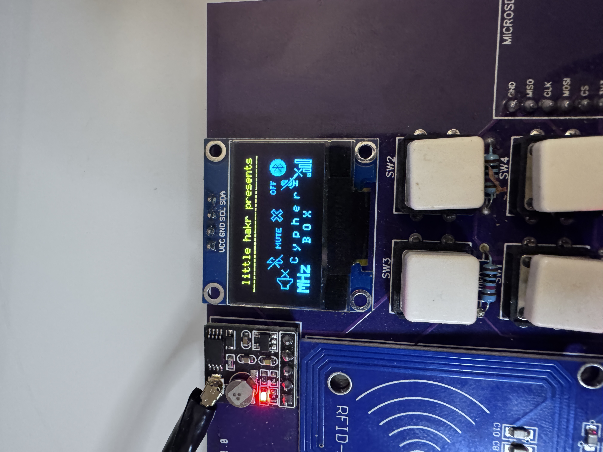
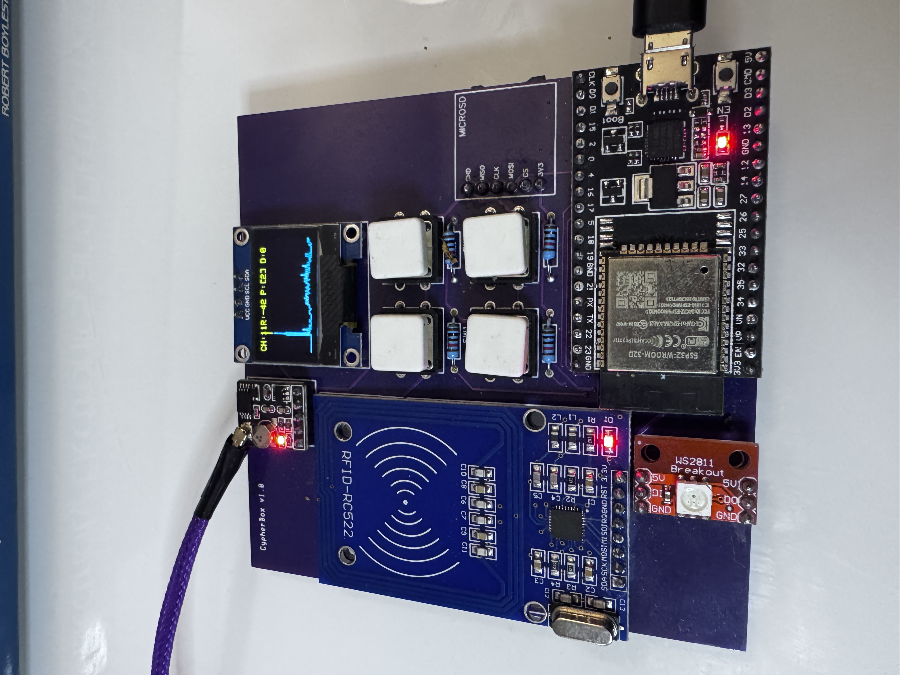

# cypherbox
## The multifunctional ESP32 cybersecurity/networking tool.

- This project leverages the ESP32-WROOM-32D microcontroller, featuring a robust setup with an SSD1306 128x64 OLED screen, an SD card module, three input buttons, a MRFC522 RFID reader, and a GPS to create a sandbox for testing cybersecurity and networking operations.
- The schematics and PCB files are available for you to create yourself!
- Get $5 for new users when you make it at PCBWay! https://pcbway.com/g/87Pi52 

**TIP**:
- **Home**: Pin 2 (**WHEN UPLOADING CODE YOU MUST HOLD DOWN THIS BUTTON TO ENTER BOOT MODE**)

## Current Features
- **GPS Wardriver**: Collect GPS/satellite data, wifi networks, and compiles it into a clean .csv format!
- **RFID/NFC Functionality**: Read/write(soon)/clone(soon) data using the MFRC522 module.
- **SD Card Operations**: Seamlessly read, load, and delete(soon) files on the SD card. Working on saving wardriver/RFID data to sd card.
- **User Interface**: Navigate options with three buttons, neopixel, & OLED screen.

## Future Features
- **Improve menu flow and button handling***: Currently you have to reset when inside packet monitor, and in some other menus. Returning to menu isnt working will all menu items.
- **Save scans to SD card** : After reading RFID/NFC/ or using GPS, save data to SD Card
- **Write from SD card** : Enter write menu, select SD Card, & choose which data to write. 

More updates will be added soon!

## Parts List

| Component                     | Description                                      |
|-------------------------------|--------------------------------------------------|
| **ESP32-WROOM-32E**       | Microcontroller with Wi-Fi and Bluetooth support |
| **SSD1306 128x64 OLED Display** | .96-inch screen for displaying information      |
| **SD Card Module**            | Module for reading and writing SD cards         |
| **MFRC522 RFID Module**     | Module for RFID reading and writing         |
| **WS2812 Neopixel LED**     | Status LED                                        |
| **Push Buttons**              | 3 buttons for user interaction                   |
| **Resistors**                 | 10kΩ resistors (optional)         |
| **Breadboard**                | For prototyping connections                       |
| **Jumper Wires**              | For making connections between components        |
| **3V Power Supply**              | Suitable power source for the ESP32             |

## Parts used to make this device:
- **ESP32-WROOM-32D**:
https://amzn.to/4j3QTLo

- **MFRC522 RFID Module**:
https://amzn.to/4gP9FEX

-**GPS Module**:
https://amzn.to/4j7HTF3

- **SSD1306 128x64 Screen**:
https://amzn.to/3TqELJe

- **SD Card Module**:
https://amzn.to/3zsvJot

- **Tactile Buttons**:
https://amzn.to/4gripRD
- **Neopixel WS2812 LED**:

## Wiring

### MFRC522 RFID Module
- **RST**: Pin 25
- **SS**: Pin 27
- **MOSI**: Pin 23
- **MISO**: Pin 19
- **SCK**: Pin 18
- **VCC**: 3V
- **GND**: GND

### SD Card Module
- **CS**: Pin 5
- **MOSI**: Pin 23
- **MISO**: Pin 19
- **SCK**: Pin 18
- **VCC**: 3V
- **GND**: GND

### GPS Module
- **TX**: Pin 17
- **RX**: Pin 16

### Neopixel WS2812 LED
- **DI**: Pin 26
- **VCC**: 5V
- **GND**: GND

### Buttons

- **Up**: Pin 34
- **Down**: Pin 35
- **Select**: Pin 15
- **Home**: Pin 2 (**WHEN UPLOADING CODE YOU MUST HOLD DOWN THIS BUTTON TO ENTER BOOT MODE**)

## Development and Updates

The code is under active development, with regular updates planned to enhance functionality and stability. Keep an eye on this repository for the latest improvements and feature additions.

